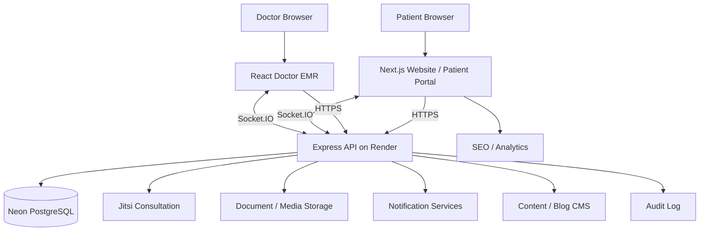
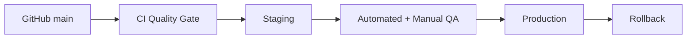

# Dr Varsha Telehealth — Production Architecture

## Logical layers

### Presentation
- Next.js public website
- Patient portal
- Doctor clinical workspace
- Responsive design system

### Application
- Authentication
- Appointment orchestration
- Patient management
- Consultation orchestration
- Clinical documentation
- Prescriptions
- Follow-ups
- Documents
- Notifications
- CMS
- Analytics

### Data
- PostgreSQL / Neon
- Transactional appointment data
- Patient and account records
- Clinical records
- Notification records
- CMS data
- Audit records

### Realtime

Socket.IO is used only for state-change signals. Source-of-truth data always remains in PostgreSQL and clients must refresh or reconcile after reconnect.

### External services

- Vercel: frontend delivery
- Render: backend runtime
- Neon: relational database
- Jitsi: video consultation
- Future payment gateway: payment order + webhook verification
- Future email/WhatsApp/push: notification delivery

## Deployment

Production is not considered released until CI, staging checks, and smoke tests succeed.
