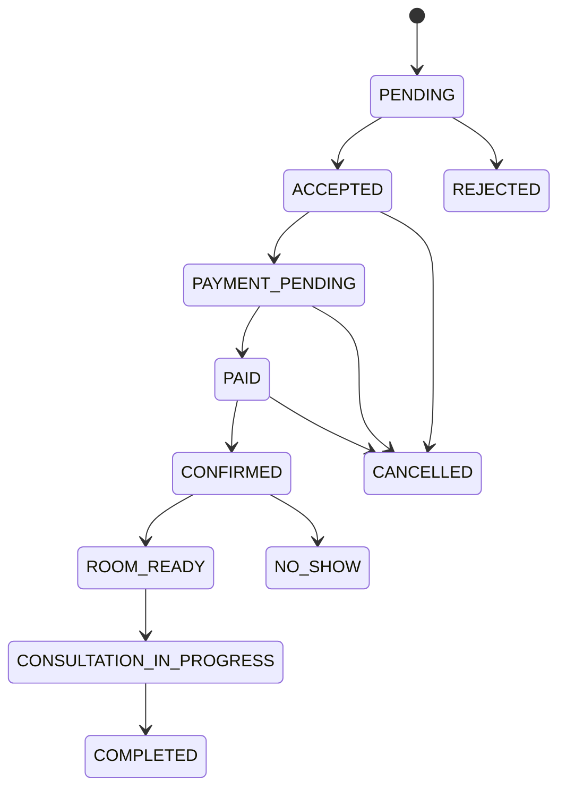

# Appointment State Machine

## Rules

- `PENDING` is created by a valid patient booking.
- Only an authenticated doctor can accept or reject.
- A future payment integration may transition `PAYMENT_PENDING -> PAID`, but browser state must never do so directly.
- Only the doctor can confirm an eligible paid appointment.
- A consultation room can only become ready for an eligible confirmed appointment.
- The patient can join only after the server exposes the room as ready.
- Terminal states are `REJECTED`, `CANCELLED`, `NO_SHOW`, and `COMPLETED`.

## Required event payload

Every realtime `appointment_updated` event should contain only non-sensitive fields required by the receiving role:

- appointment id
- status
- meeting status
- video room identifier where appropriate
- consultation status
- payment status when payment is enabled

Clinical notes and document content must never be broadcast through Socket.IO.
